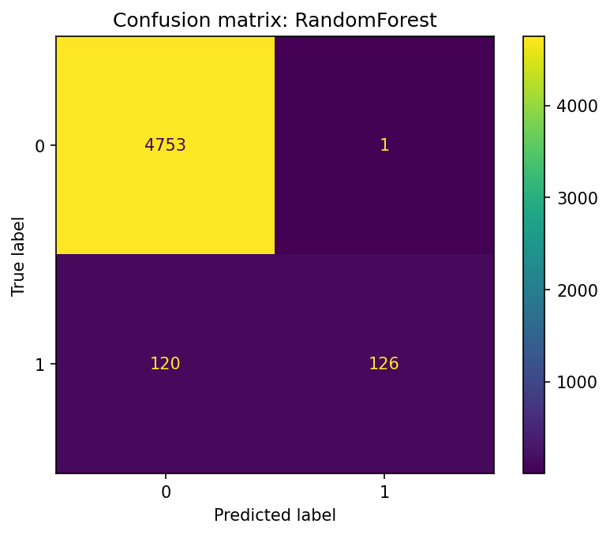
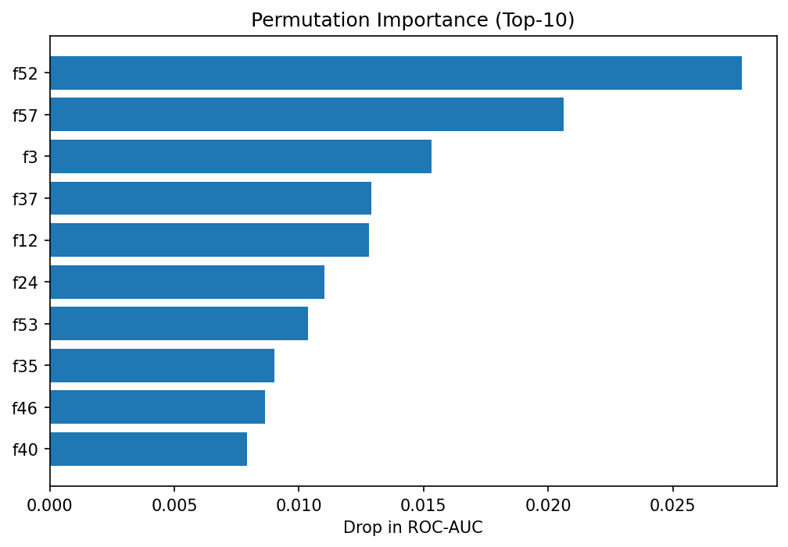

# HW06 – Report

> Файл: `homeworks/HW06/report.md`  
> Важно: не меняйте названия разделов (заголовков). Заполняйте текстом и/или вставляйте результаты.

## 1. Dataset

- Какой датасет выбран: `S06-hw-dataset-04.csv`
- Размер: (2500, 62)
- Целевая переменная: `target` (бинарная, из 25000 наблюдений 23770 относится к классу 0, 1230 к классу 1)
- Признаки: 60 признаков, все типа float64; проверка на признаки с малым числом уникальных значений не выявила категориально-подобных переменных

## 2. Protocol

- Разбиение: train/test = 0.8/0.2, random_state = 42
- Подбор: Гиперпараметры подбирались только на train с помощью 5-fold CV (GridSearchCV); тест использовался один раз для финальной оценки. Оптимизировали F1
- Метрики: accuracy - бахова яобщая точность, F1 - ключевая метрика при дисбалансе, ROC-AUC - основной критерий сравнения для бинарной задачи

## 3. Models

- DummyClassifier (baseline) — стратегия most_frequent (предсказывает наиболее частый класс)
- LogisticRegression (baseline) — в Pipeline со StandardScaler; подбирался параметр регуляризации C
- DecisionTreeClassifier — контроль сложности через max_depth и min_samples_leaf (GridSearch)
- RandomForestClassifier — подбирались n_estimators, max_depth, min_samples_leaf, max_features
- HistGradientBoostingClassifier — подбирались max_depth, learning_rate, max_iter, min_samples_leaf
- StackingClassifier — базовые модели: DecisionTree, RandomForest, HistGB; метамодель — LogisticRegression; использовалась встроенная CV-логика стекинга

## 4. Results

| Модель                 |   Accuracy |         F1 |    ROC-AUC |
|------------------------|-----------:|-----------:| ---------: |
| DecisionTree           |     0.9644 |     0.6027 |     0.8067 |
| RandomForest       |     0.9758 |     0.6756 | 0.9020 |
| HistGradientBoosting   |     0.9794 |   0.7469 |     0.8903 |

RandomForest показал наилучший ROC-AUC (0.9020), что говорит о наиболее устойчивом разделении классов при сильном дисбалансе

## 5. Analysis

- Устойчивость: Для RandomForest и HistGradientBoosting были выполнены 5 прогонов с разными random_state. Метрики менялись незначительно (колебания ROC-AUC в пределах ~±0.01, F1 — ~±0.02). Порядок лучших моделей не изменился: RandomForest оставался лидером по ROC-AUC.
- Ошибки: 
  Модель в целом разделяет классы хорошо (ROC-AUC = 0.902), но из-за сильного дисбаланса часто пропускает редкий класс 1, что снижает F1

- Интерпретация: 
Permutation importance показывает, что RandomForest опирается на небольшое ядро действительно информативных признаков, тогда как вклад большинства остальных переменных второстепенный

## 6. Conclusion

- Одиночные деревья просты и интерпретируемы, но легко переобучаются без контроля сложности
- Ансамбли (RandomForest, бустинг) существенно устойчивее и дают более стабильное качество
- Метрики должны соответствовать задаче и дисбалансу, иначе оценки качества будут вводить в заблуждение
- Воспроизводимость (фиксированный random_state и прозрачный пайплайн) — ключевая часть честного ML-протокола
