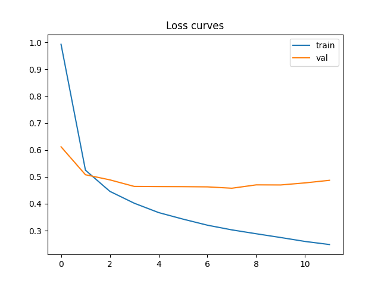
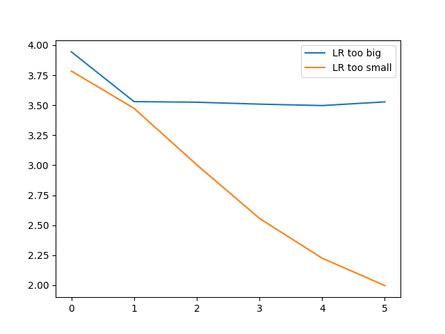

# HW08-09 Report

## 1. Dataset

В работе использовался датасет **EMNIST (split="balanced")**, загруженный через `torchvision`.

Датасет содержит рукописные символы и включает **47 классов**.
Изображения имеют размер **28×28** пикселей.

Стандартное разделение из torchvision:

* train
* test

Из train дополнительно была выделена **валидационная выборка (80/20)** с фиксированным `seed = 42`.

Все данные загружались через `DataLoader`.

---

## 2. Model

В работе использовалась полносвязная нейронная сеть (**MLP**).

Архитектура модели:

* Flatten
* Linear(784 → 256)
* ReLU
* BatchNorm
* Linear(256 → 128)
* ReLU
* Linear(128 → 47)

Основные параметры модели:

* optimizer: **Adam**
* learning rate: **0.001**
* loss: **CrossEntropyLoss**
* seed: **42**

Конфигурация лучшей модели хранится в
`artifacts/best_config.json` 

---

## 3. Experiments S08 (Regularization)

Были проведены следующие эксперименты:

**E1 — Base model**

* MLP без Dropout
* без BatchNorm

**E2 — Dropout**

* добавлен Dropout

**E3 — BatchNorm**

* добавлен BatchNorm между Linear и ReLU

**E4 — EarlyStopping**

Для обучения с ранней остановкой была выбрана лучшая архитектура из E2 и E3 по `val_accuracy`.

Использовался параметр:

```
patience = 4
```

Лучшая модель была сохранена:

```
artifacts/best_model.pt
```

---

## 4. Training curves

Кривые обучения лучшей модели показаны на графике:



Наблюдения:

* training loss стабильно уменьшается
* validation loss сначала уменьшается, затем стабилизируется
* небольшое расхождение train и val говорит о начале переобучения

Использование **BatchNorm** помогает стабилизировать обучение.

---

## 5. Experiments S09 (Optimization)

Для анализа влияния learning rate были проведены три эксперимента.

**O1 — слишком большой learning rate**

```
lr = 0.1
```

Loss почти не уменьшается и обучение становится нестабильным.

**O2 — слишком маленький learning rate**

```
lr = 1e-5
```

Обучение происходит очень медленно.

График поведения loss:



---

## 6. SGD + Momentum + Weight Decay

Также был протестирован оптимизатор:

```
SGD
momentum = 0.9
weight_decay = 1e-4
```

Это позволило сравнить обучение с Adam.

Adam показал более быстрое сходимость, но SGD с momentum демонстрирует более стабильное поведение при правильном выборе learning rate.

---

## 7. Final model evaluation

Лучшая модель была выбрана по **validation accuracy** и затем протестирована на test-выборке.

Test evaluation выполнялся **один раз**, как требуется в задании.

Итоговые результаты экспериментов приведены в:

```
[artifacts/runs.csv](artifacts/runs.csv)
```

---

## 8. Artifacts

В папке `artifacts` находятся:

```
runs.csv
best_model.pt
best_config.json
figures/curves_best.png
figures/curves_lr_extremes.png
```

---

## 9. Conclusion

В ходе работы были изучены основные механизмы обучения нейронных сетей в PyTorch.

Основные выводы:

* регуляризация (BatchNorm, Dropout) помогает уменьшить переобучение
* слишком большой learning rate делает обучение нестабильным
* слишком маленький learning rate замедляет обучение
* Adam показывает более быструю сходимость по сравнению с SGD

Лучшей моделью стала **MLP с BatchNorm**, обученная с использованием **EarlyStopping**.